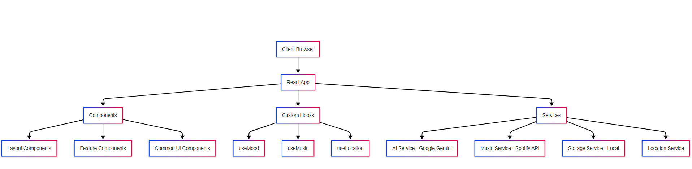
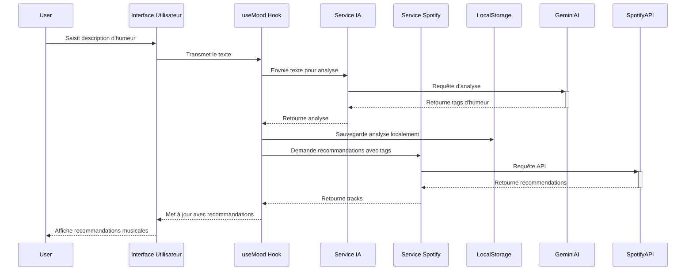
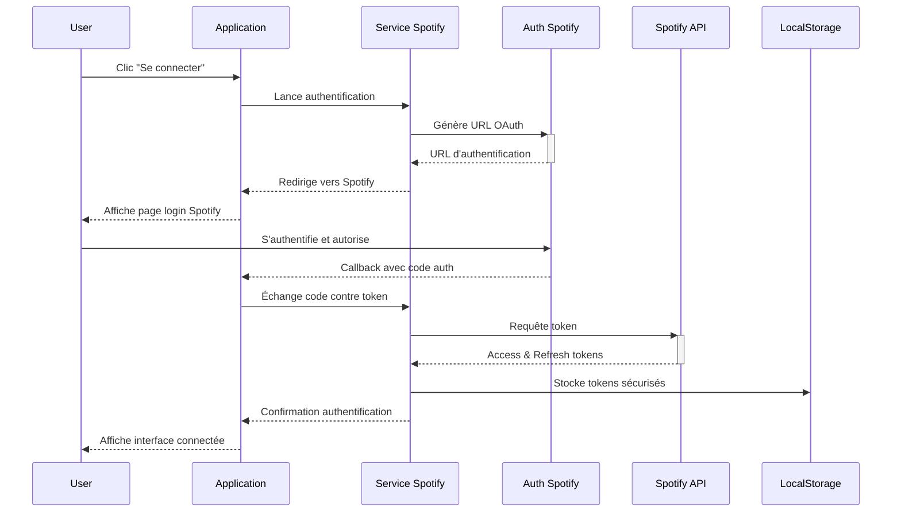

# Documentation complète de Mood Music V1 🎵✨


## 📖 Sommaire

1. [Introduction](#introduction)
2. [Vision et concept](#vision-et-concept)
3. [Architecture technique détaillée](#architecture-technique-détaillée)
4. [Fonctionnalités principales](#fonctionnalités-principales)
5. [Services et APIs](#services-et-apis)
6. [Composants UI et design system](#composants-ui-et-design-system)
7. [État du projet et roadmap](#état-du-projet-et-roadmap)
8. [Guide d'installation et déploiement](#guide-dinstallation-et-déploiement)
9. [Configuration et environnement](#configuration-et-environnement)
10. [Structure du code et conventions](#structure-du-code-et-conventions)
11. [Workflows et performances](#workflows-et-performances)
12. [FAQ et troubleshooting](#faq-et-troubleshooting)
13. [Contribution et développement](#contribution-et-développement)
14. [Licence et crédits](#licence-et-crédits)

---

## Introduction

**Mood Music** est une application web progressive (PWA) révolutionnaire qui utilise l'intelligence artificielle pour créer une expérience musicale personnalisée en fonction de l'état émotionnel de l'utilisateur. L'application analyse l'humeur de l'utilisateur à travers des descriptions textuelles ou des images et fournit des recommandations musicales adaptées via l'API Spotify.


Développée par [TheTigerFox](https://github.com/theTigerFox), Mood Music représente une convergence entre l'intelligence artificielle, le design d'expérience utilisateur avancé et la passion pour la musique. Plus qu'une simple application de recommandation musicale, elle propose une nouvelle façon de découvrir et de consommer de la musique basée sur les émotions plutôt que sur les genres ou artistes.

> "Ta musique en fonction de ton mood" - le slogan qui capture l'essence même de l'application.

---

## Vision et concept

### Origine du projet

Mood Music est né d'un constat simple : les plateformes de streaming musical existantes proposent principalement des recommandations basées sur des genres, des artistes similaires ou des habitudes d'écoute, mais rarement sur l'état émotionnel spécifique de l'utilisateur à un moment donné. Or, notre relation à la musique est profondément émotionnelle.

L'idée était donc de créer une interface qui permet à l'utilisateur d'exprimer son humeur actuelle de manière naturelle (texte conversationnel ou image) et de recevoir instantanément des recommandations musicales qui résonnent avec cet état d'esprit.

### Principes fondamentaux

1. **Empathie émotionnelle** : L'application comprend véritablement les nuances des émotions humaines
2. **Design immersif** : Une expérience visuelle captivante qui amplifie l'expérience musicale
3. **Accessibilité** : Utilisable par tous, avec ou sans compte Spotify
4. **Respect de la vie privée** : Traitement minimal des données personnelles
5. **Progressive enhancement** : Fonctionne sur tous les appareils avec des fonctionnalités adaptées

### Public cible

- Mélomanes à la recherche de nouvelles découvertes musicales
- Personnes utilisant la musique comme support émotionnel ou thérapeutique
- Utilisateurs des services de streaming musical cherchant une expérience plus personnalisée
- Amateurs de design et d'interfaces innovantes
- Curieux des applications d'intelligence artificielle dans la vie quotidienne

### Différenciateurs clés

- **Analyse émotionnelle bi-modale** : Par texte et image, contrairement aux applications qui n'utilisent que des mots-clés prédéfinis
- **Design immersif et émotionnel** : Interface qui évolue et s'adapte à l'humeur détectée
- **Exploration géographique** : Dimension culturelle unique via la découverte de musique par localisation
- **Interface conversationnelle** : Expérience naturelle d'expression des émotions
- **Compatibilité PWA complète** : Véritable expérience d'application native sur tous les appareils

---

## Architecture technique détaillée

### Vue d'ensemble

Mood Music est construit sur une architecture moderne centrée sur React et TypeScript, avec une approche orientée composants et hooks personnalisés. L'application fonctionne principalement côté client, avec des interactions avec différentes APIs tierces pour les fonctionnalités d'IA et de musique.



### Stack technologique complet

#### Frontend Core
- **React 18.2.0** : Bibliothèque UI avec gestion des composants via hooks
- **TypeScript 5.0.2** : Typage statique pour la robustesse du code
- **Vite 4.3.9** : Build tool pour le développement et la production
- **React Router 6.10.0** : Gestion du routage et de la navigation

#### Styling et UI
- **TailwindCSS 3.3.1** : Framework CSS utility-first
- **Tailwind Custom Extensions** : Plugins personnalisés pour animations et effets
- **FontAwesome** : Bibliothèque d'icônes vectorielles
- **Google Fonts (Poppins)** : Police principale de l'application

#### State Management
- **React Context API** : Gestion d'état global légère
- **Custom Hooks** : Encapsulation de la logique métier et de l'état

#### API Integration
- **Google Generative AI SDK** : Pour l'intégration avec Gemini AI
- **Fetch API** : Communications HTTP natives
- **OAuth 2.0** : Pour l'authentification Spotify

#### PWA Features
- **Vite PWA Plugin** : Génération des assets et configurations PWA
- **Workbox** : Gestion avancée du service worker et des stratégies de cache
- **Web App Manifest** : Configuration pour l'installation sur appareils

#### Dev Tools
- **ESLint** : Linting et application des bonnes pratiques
- **Prettier** : Formatage cohérent du code
- **TypeScript** : Vérification statique des types
- **Chrome DevTools** : Debugging et optimisation des performances

### Structure détaillée du projet

```
mood-music/
├── public/                     # Ressources statiques
│   ├── icons/                  # Icônes PWA dans différentes tailles
│   │   ├── mood-72.png
│   │   ├── mood-96.png
│   │   ├── mood-128.png
│   │   ├── mood-192.png
│   │   ├── mood-249.png        # Logo principal
│   │   ├── mood-512.png
│   │   └── favicon.ico
│   ├── screenshots/            # Captures d'écran de l'application
│   │   ├── home.png
│   │   └── mood-space.png
│   ├── splash/                 # Écrans de démarrage iOS
│   ├── manifest.json           # Configuration PWA
│   └── service-worker.js       # Service worker pour PWA
│
├── src/
│   ├── assets/                 # Images et ressources
│   │   ├── backgrounds/
│   │   └── icons/
│   │
│   ├── components/             # Composants React réutilisables
│   │   ├── common/             # Composants de base
│   │   │   ├── Button.tsx
│   │   │   ├── Card.tsx
│   │   │   ├── WaveAnimation.tsx
│   │   │   ├── Modal.tsx
│   │   │   └── ...
│   │   ├── layout/             # Composants de structure
│   │   │   ├── Layout.tsx      # Layout principal avec header et footer
│   │   │   ├── Header.tsx
│   │   │   └── Footer.tsx
│   │   ├── home/               # Composants spécifiques à la page d'accueil
│   │   │   ├── MoodSelector.tsx
│   │   │   ├── RecommendedTracks.tsx
│   │   │   └── ...
│   │   ├── location/           # Composants liés à la localisation
│   │   │   ├── LocationMap.tsx
│   │   │   ├── LocationSelector.tsx
│   │   │   └── MusicByLocation.tsx
│   │   ├── mood/               # Composants liés à l'analyse d'humeur
│   │   │   ├── MoodAnalyzer.tsx
│   │   │   ├── MoodChat.tsx
│   │   │   ├── ImageUploader.tsx
│   │   │   └── ...
│   │   └── playlist/           # Composants liés aux playlists
│   │       ├── PlaylistCard.tsx
│   │       ├── PlaylistCreator.tsx
│   │       └── ...
│   │
│   ├── config/                 # Configuration de l'application
│   │   ├── constants.ts        # Constantes et routes
│   │   └── gemini.ts           # Configuration de l'API Gemini
│   │
│   ├── hooks/                  # Hooks personnalisés React
│   │   ├── useLocation.ts      # Gestion de la localisation
│   │   ├── useMood.ts          # Gestion de l'analyse d'humeur
│   │   ├── useMusic.ts         # Gestion des fonctionnalités musicales
│   │   └── useMusicPlayer.ts   # Contrôle du lecteur de musique
│   │
│   ├── pages/                  # Composants de pages principales
│   │   ├── Home.tsx            # Page d'accueil
│   │   ├── MoodSpace.tsx       # Page d'analyse d'humeur
│   │   ├── LocationMusic.tsx   # Page de musique par localisation
│   │   ├── Playlists.tsx       # Page de gestion des playlists
│   │   ├── About.tsx           # Page À propos
│   │   ├── Contact.tsx         # Page Contact
│   │   └── Privacy.tsx         # Politique de confidentialité
│   │
│   ├── services/               # Services et logique métier
│   │   ├── ai.ts               # Service d'analyse par IA
│   │   ├── location.ts         # Service de localisation
│   │   ├── music.ts            # Service de gestion musicale
│   │   └── storage.ts          # Service de stockage local
│   │
│   ├── styles/                 # Styles globaux et utilitaires
│   │   └── tailwind.css        # Imports et personnalisations TailwindCSS
│   │
│   ├── types/                  # Définitions TypeScript
│   │   ├── location.ts         # Types liés à la localisation
│   │   ├── mood.ts             # Types liés à l'humeur
│   │   └── music.ts            # Types liés à la musique
│   │
│   ├── utils/                  # Fonctions utilitaires
│   │   ├── api.ts              # Utilitaires API
│   │   ├── formatters.ts       # Formatage de données
│   │   └── moodAnalysis.ts     # Analyse d'humeur
│   │
│   ├── App.tsx                 # Composant racine
│   ├── App.css                 # Styles spécifiques à l'application
│   ├── index.css               # Styles globaux
│   ├── main.tsx                # Point d'entrée de l'application
│   └── vite-env.d.ts           # Types pour Vite
│
├── .env.example                # Exemple de configuration des variables d'environnement
├── .gitignore                  # Fichiers et dossiers ignorés par Git
├── index.html                  # Point d'entrée HTML
├── package.json                # Dépendances et scripts
├── postcss.config.js           # Configuration PostCSS
├── tailwind.config.js          # Configuration de TailwindCSS
├── tsconfig.json               # Configuration TypeScript
├── vite.config.ts              # Configuration Vite
└── README.md                   # Documentation du projet
```

### Flux de données principaux

#### Flux d'analyse d'humeur et recommandation


#### Flux d'authentification Spotify


### Modèle de données

#### Types principaux
```typescript
// Types liés à l'humeur
interface MoodTags {
    emotions: string[];        // ex: ['joyeux', 'excité']
    intensity: number;         // 0-100
    genres: string[];          // ex: ['pop', 'dance']
    tempo: string[];           // ex: ['rapide', 'énergique']
    atmosphere: string[];      // ex: ['festive', 'légère']
    instruments: string[];     // ex: ['guitare', 'synthétiseur']
    eras: string[];            // ex: ['années 80', 'contemporain']
    artists: string[];         // ex: ['Daft Punk', 'The Weeknd']
    tracks: string[];          // ex: ['Blinding Lights']
}

// Type pour une analyse d'image
interface ImageTags extends Omit<MoodTags, 'eras'> {
    colors: string[];          // ex: ['bleu', 'violet']
    time: string[];            // ex: ['nuit', 'crépuscule']
    season: string[];          // ex: ['été', 'automne']
}

// Type pour un morceau de musique
interface Track {
    id: string;
    name: string;
    uri: string;
    preview_url: string | null;
    popularity: number;
    artists: {
        id: string;
        name: string;
        uri: string;
    }[];
    album: {
        id: string;
        name: string;
        release_date: string;
        images: {
            url: string;
            height: number;
            width: number;
        }[];
    };
    external_urls: {
        spotify: string;
    };
}

// Type pour une localisation
interface Location {
    latitude: number;
    longitude: number;
    country: string;
    countryCode: string;
    city?: string;
    region?: string;
    displayName: string;
}

// Type pour un message du chat
interface ChatMessage {
    id: string;
    content: string;
    role: 'user' | 'assistant';
    timestamp: Date;
    imageUrl?: string;
    tags?: MoodTags | ImageTags;
}
```

---

## Fonctionnalités principales

### 1. Analyse d'humeur par IA

#### Analyse textuelle
- **Interface conversationnelle** avec l'assistant IA "Moody"
- Traitement du **langage naturel** pour comprendre les nuances émotionnelles
- Extraction de paramètres émotionnels et musicaux via l'API Google Gemini
- Système de tagging multi-dimensionnel (émotions, intensité, genres, tempo, ambiance...)
- Support de descriptions complexes et contextuelles

```typescript
// Extrait simplifié du processus d'analyse textuelle
export const analyzeMoodFromText = async (text: string): Promise<MoodAnalysisResponse> => {
  // Configuration de l'API Gemini
  const model = geminiAI.getGenerativeModel({ model: "gemini-2.0-flash" });
  
  // Prompt système optimisé pour l'analyse d'humeur
  const systemPrompt = `${moodAnalysisSystemPrompt}\n\n`;
  
  // Création de la session de chat avec l'IA
  const chat = model.startChat({
    generationConfig: { temperature: 0.7, topK: 40, maxOutputTokens: 1024 },
    history: [
      { role: "user", parts: [{ text: "..." }]},
      { role: "model", parts: [{ text: "..." }]},
      { role: "user", parts: [{ text: systemPrompt }]},
    ]
  });
  
  // Envoi du texte utilisateur et récupération de l'analyse
  const result = await chat.sendMessage(text);
  const content = result.response.text();
  
  // Extraction et validation des données JSON
  const moodTags = extractMoodTagsFromResponse(content);
  
  return {
    response: createConversationalResponse(moodTags),
    moodTags: ensureValidMoodTags(moodTags),
    rawResponse: content
  };
};
```

#### Analyse d'image
- **Upload d'images** depuis l'appareil
- Analyse visuelle par **vision artificielle** (Gemini Vision)
- Détection du contenu, des couleurs, compositions et ambiances
- Traduction des éléments visuels en paramètres musicaux
- Interface visuelle intuitive avec prévisualisation et feedback

#### Système de tagging sophistiqué
Le système de tags est le cœur de l'analyse d'humeur, avec des champs multiples :

- **Émotions** : Identifie les émotions principales (joie, tristesse, nostalgie, etc.)
- **Intensité** : Échelle de 0-100 pour calibrer l'énergie des recommandations
- **Genres** : Styles musicaux correspondant à l'humeur
- **Tempo** : Rythme musical adapté (lent, modéré, rapide)
- **Ambiance** : Atmosphère générale (apaisante, énergique, festive, etc.)
- **Instruments** : Instruments qui résonnent avec l'humeur
- **Ères** : Périodes musicales pertinentes (années 80, contemporain, etc.)
- **Artistes** : Suggestions d'artistes spécifiques (nouveauté récente)
- **Chansons** : Titres particuliers recommandés (nouveauté récente)

Pour les images, des tags spécifiques sont ajoutés :
- **Couleurs** : Palette de couleurs dominantes
- **Moment** : Période de la journée évoquée (aube, jour, crépuscule, nuit)
- **Saison** : Saison évoquée (printemps, été, automne, hiver)

### 2. Recommandations musicales intelligentes

#### Système de recommandation hybride
- **Analyse émotionnelle** : Traduit les tags d'humeur en paramètres de recherche musicale
- **Intégration Spotify** : Utilisation de l'API de recherche et de recommandation
- **Recommandation par artiste** : Priorisation des artistes suggérés par l'IA
- **Fallbacks intelligents** : Système à plusieurs niveaux pour garantir des résultats pertinents
- **Filtrage adaptatif** : Ajustement des recommandations selon l'intensité émotionnelle

```typescript
// Extrait du système de recommandation musical
async searchByMoodTags(moodTags: MoodTags, limit: number = 10): Promise<Track[]> {
  try {
    console.log('Recherche basée sur les tags d\'humeur:', moodTags);

    // 1. Priorisation des artistes suggérés par l'IA
    let searchQuery = '';
    if (moodTags.artists && moodTags.artists.length > 0) {
      const artist = moodTags.artists[0];
      searchQuery = `artist:"${artist}"`;
      // Ajouter un titre spécifique si suggéré
      if (moodTags.tracks && moodTags.tracks.length > 0) {
        searchQuery += ` track:"${moodTags.tracks[0]}"`;
      }
    }
    // 2. Utiliser les genres comme fallback
    else if (moodTags.genres && moodTags.genres.length > 0) {
      const validGenres = moodTags.genres.filter(genre => 
          SAFE_SPOTIFY_GENRES.includes(genre.toLowerCase())
      );
      searchQuery = validGenres.length > 0 ? 
        `genre:${validGenres[0]}` : 'genre:pop';
    }
    // 3. Dernier recours
    else {
      searchQuery = 'genre:pop';
    }

    // Enrichir la requête avec l'ambiance
    if (moodTags.atmosphere && moodTags.atmosphere.length > 0) {
      searchQuery += ` ${moodTags.atmosphere[0]}`;
    }
    
    // Exécuter la recherche
    const response = await this.search(searchQuery, 'track', limit);
    
    // Gérer les fallbacks si nécessaire
    // [Code de fallback omis pour concision]
    
    return tracks;
  } catch (error) {
    console.error('Erreur lors de la recherche par tags d\'humeur:', error);
    return this.searchTracksByGenre('pop', limit); // Fallback sûr
  }
}
```

#### Interface de découverte musicale
- **Prévisualisation audio** des morceaux recommandés
- **Informations détaillées** sur les artistes et albums
- **Cartes interactives** avec contrôles de lecture
- **Liens directs** vers Spotify pour l'écoute intégrale
- **Création de playlist** à partir des recommandations

#### Adapté aux utilisateurs non connectés
- Expérience complète même sans compte Spotify
- Prévisualisations audio disponibles sans authentification
- Informations complètes sur les morceaux et artistes
- Possibilité de s'authentifier à tout moment pour enrichir l'expérience

### 3. Exploration musicale par localisation

#### Fonctionnalités de géolocalisation
- **Détection automatique** de la position de l'utilisateur
- **Recherche de lieux** pour explorer différentes régions
- **Cartographie interactive** pour la sélection des lieux
- **Affichage des tendances régionales** musicales
- **Interface adaptative** entre mobile et desktop

```typescript
// Extrait du service de recommandation musicale par localisation
async getTopTracksByCountry(countryCode: string, limit: number = 10): Promise<Track[]> {
  try {
    console.log(`Recherche de morceaux pour le pays: ${countryCode}`);
    
    // Valider et normaliser le code pays
    if (!countryCode || countryCode.trim().length !== 2) {
      countryCode = 'FR'; // Fallback vers la France
    }
    
    // Obtenir le nom complet du pays
    let countryName = new Intl.DisplayNames(['fr'], { type: 'region' }).of(countryCode);
    
    // Stratégie 1: "music from [pays]"
    let searchResponse = await this.search(`music from ${countryName}`, 'track', limit);
    if (searchResponse?.tracks?.items?.length > 0) {
      return searchResponse.tracks.items;
    }
    
    // Stratégie 2: Recherche directe du nom du pays
    searchResponse = await this.search(countryName, 'track', limit);
    if (searchResponse?.tracks?.items?.length > 0) {
      return searchResponse.tracks.items;
    }
    
    // Stratégie 3: "popular music [pays]"
    searchResponse = await this.search(`popular music ${countryName}`, 'track', limit);
    if (searchResponse?.tracks?.items?.length > 0) {
      return searchResponse.tracks.items;
    }
    
    // Fallback vers la France si différent
    if (countryCode !== 'FR') {
      return this.getTopTracksByCountry('FR', limit);
    }
    
    // Dernier recours: recherche générique
    return this.search('popular music', 'track', limit).tracks?.items || [];
  } catch (error) {
    console.error(`Erreur lors de la recherche par pays ${countryCode}:`, error);
    return countryCode !== 'FR' ? 
      this.getTopTracksByCountry('FR', limit) : [];
  }
}
```

#### Interface cartographique
- Visualisation de la localisation sélectionnée
- Carte interactive basée sur OpenStreetMap
- Adaptation aux écrans mobiles et desktop
- Transitions fluides entre les différentes régions

### 4. Interface utilisateur avancée

#### Design système cohérent
- **Thème sombre immersif** avec accents de couleur violets et bleus
- **Glassmorphisme** et effets de transparence pour une esthétique moderne
- **Animations fluides** pour une expérience dynamique
- **Composants réutilisables** pour une cohérence visuelle
- **Micro-interactions** pour un feedback instantané

#### Components UI principaux
- **Cards** : Conteneurs principaux avec effets visuels avancés
- **Buttons** : Boutons personnalisés avec variantes et états
- **Wave Animation** : Animations fluides pour les fonds
- **Music Player** : Lecteur audio intégré pour les prévisualisations
- **Chat Interface** : Interface conversationnelle pour l'analyse d'humeur
- **Image Uploader** : Système de téléchargement d'images avec prévisualisation

```tsx
// Exemple du composant Card avec variantes de style
const Card: React.FC<CardProps> = ({
  children,
  className = "",
  variant = "default",
  padding = "default",
  shadow = "default",
  hover = false,
  onClick
}) => {
  // Définition des classes conditionnelles
  const variantClasses = {
    default: "bg-gray-900/90 border border-white/10",
    glass: "bg-white/5 backdrop-blur-sm border border-white/10",
    gradient: `bg-gradient-to-br from-purple-900/50 via-purple-800/30 to-blue-900/40 
               border border-white/10`,
    dark: "bg-black/80 border border-gray-800/80"
  };
  
  const paddingClasses = {
    none: "",
    small: "p-3",
    default: "p-6",
    large: "p-8"
  };
  
  const shadowClasses = {
    none: "",
    default: "shadow-md",
    lg: "shadow-lg",
    xl: "shadow-xl"
  };
  
  const hoverClass = hover ? "transition-all duration-300 hover:bg-white/10" : "";
  
  return (
    <div
      className={`rounded-xl ${variantClasses[variant]} ${paddingClasses[padding]} 
                  ${shadowClasses[shadow]} ${hoverClass} ${className}`}
      onClick={onClick}
    >
      {children}
    </div>
  );
};
```

#### Responsive design avancé
- **Mobile-first approach** avec adaptations spécifiques
- **Interfaces différenciées** entre mobile et desktop
- **Contrôles adaptés** aux interactions tactiles et souris
- **Media queries** pour tous les breakpoints
- **Animations optimisées** selon les capacités de l'appareil

### 5. Fonctionnalités PWA

#### Installation sur appareils
- **Manifeste complet** : Configuration pour l'installation sur iOS et Android
- **Icônes adaptatives** : Images optimisées pour tous les appareils
- **Splash screens** : Écrans de chargement personnalisés pour iOS
- **Détection d'installation** : Invite d'installation intelligente

#### Service worker et performances
- **Mise en cache stratégique** des ressources statiques
- **Stratégies différenciées** selon les types de contenus
- **Gestion hors-ligne** avec page de fallback
- **Mises à jour intelligentes** avec notifications

#### Optimisation pour mobiles
- **Interactions tactiles** optimisées
- **Boutons accessibles** et suffisamment larges
- **Données locales** pour minimiser la consommation réseau
- **Performances optimisées** pour les appareils moins puissants

### 6. Autres fonctionnalités notables

#### Historique d'humeur
- **Sauvegarde locale** des analyses d'humeur précédentes
- **Visualisation de l'historique** avec données clés
- **Rappel des recommandations** passées
- **Gestion et suppression** des entrées

#### Pages informatives
- **Page À propos** : Description du projet et du développeur
- **Page Contact** : Informations de contact et réseaux sociaux
- **Page Confidentialité** : Politique détaillée sur la gestion des données

#### Authentification Spotify
- **OAuth 2.0** pour une authentification sécurisée
- **Stockage sécurisé** des tokens
- **Refresh automatique** des tokens expirés
- **Déconnexion** avec nettoyage des données

---

## Services et APIs

### Service d'IA (ai.service.ts)

Le service d'IA est le composant central pour l'analyse d'humeur, utilisant l'API Google Gemini pour comprendre les émotions exprimées par l'utilisateur. Il gère à la fois l'analyse de texte et d'image.

#### Fonctionnalités principales
- **Analyse de texte** : Traitement du langage naturel pour extraire des émotions et préférences musicales
- **Analyse d'image** : Vision par ordinateur pour détecter l'ambiance visuelle
- **Extraction de tags** : Système sophistiqué de catégorisation émotionnelle et musicale
- **Gestion des prompts** : Optimisation des instructions pour l'IA

```typescript
// Structure simplifiée du service AI
export class AIService {
  private genAI: GoogleGenerativeAI;
  private model: any;

  constructor() {
    this.genAI = new GoogleGenerativeAI(GEMINI_API_KEY);
    this.model = this.genAI.getGenerativeModel({ 
      model: "gemini-2.0-flash" 
    });
  }

  /**
   * Analyse une description textuelle de l'humeur
   */
  async analyzeMood(moodDescription: string): Promise<MoodAnalysisResponse> {
    // Configuration et sécurité
    // Création du chat avec prompt système
    // Envoi de la requête à l'API
    // Traitement de la réponse et extraction des tags
    // Validation et enrichissement des données
    // Gestion des erreurs et fallbacks
  }

  /**
   * Analyse une image pour en extraire l'ambiance
   */
  async analyzeImage(imageBase64: string): Promise<ImageAnalysisResponse> {
    // Configuration du modèle de vision
    // Préparation de l'image
    // Envoi à l'API Gemini Vision
    // Traitement de la réponse
    // Extraction des tags visuels et émotionnels
    // Validation et enrichissement
    // Gestion des erreurs et fallbacks
  }
}
```

#### Configuration des prompts
Les prompts système sont soigneusement conçus pour guider l'IA vers une analyse émotionnelle pertinente :

```typescript
// Exemple de prompt système pour l'analyse d'humeur
export const moodAnalysisSystemPrompt = `
Tu es Moody, un assistant conversationnel spécialisé dans l'analyse d'humeur et la recommandation musicale.

IMPORTANT: Tu dois ABSOLUMENT répondre UNIQUEMENT en format JSON, avec la structure exacte suivante et rien d'autre :
{
  "response": "Ta réponse conversationnelle ici...",
  "moodTags": {
    "emotions": [...],
    "intensity": (nombre entre 0 et 100),
    "genres": [...],
    "tempo": [...],
    "atmosphere": [...],
    "instruments": [...],
    "eras": [...],
    "artists": [...],
    "tracks": [...]
  }
}

Ta mission est d'analyser la description d'humeur fournie et d'extraire des tags pertinents pour la recherche musicale.
[Instructions détaillées sur l'analyse émotionnelle...]

TOUS les champs doivent être présents et le champ "artists" ne doit jamais être vide.
`;
```

### Service musical (music.service.ts)

Ce service gère toute l'interaction avec l'API Spotify, depuis l'authentification jusqu'aux recommandations musicales.

#### Fonctionnalités principales
- **Authentification OAuth** : Gestion complète du flux OAuth 2.0 pour Spotify
- **Recherche musicale** : Requêtes de recherche adaptées aux tags d'humeur
- **Recommandations** : Algorithme de recommandations musicales à plusieurs niveaux
- **Gestion de playlists** : Création et modification de playlists Spotify
- **Localisation musicale** : Recommandations adaptées à la région géographique

```typescript
// Structure simplifiée du service musical
export class MusicService {
  private clientId: string;
  private redirectUri: string;
  private tokenData: TokenData | null = null;
  private clientTokenData: ClientTokenData | null = null;

  constructor() {
    this.clientId = import.meta.env.VITE_SPOTIFY_CLIENT_ID;
    this.redirectUri = import.meta.env.VITE_SPOTIFY_REDIRECT_URI;
    this.loadTokensFromStorage();
  }

  /**
   * Authentification et gestion des tokens
   */
  generateAuthUrl(): string {...}
  exchangeAuthCode(code: string): Promise<TokenData> {...}
  getClientCredentialsToken(): Promise<ClientTokenData> {...}
  refreshAccessToken(): Promise<TokenData> {...}
  
  /**
   * Requêtes API Spotify
   */
  async search(query: string, type: string, limit: number): Promise<any> {...}
  async getRecommendations(params: Record<string, any>): Promise<any> {...}
  
  /**
   * Méthodes de recherche spécialisées
   */
  async searchTracksByGenre(genre: string, limit: number): Promise<Track[]> {...}
  async searchByMoodTags(moodTags: MoodTags, limit: number): Promise<Track[]> {...}
  async searchByArtist(artistName: string, limit: number): Promise<Track[]> {...}
  async getTopTracksByCountry(countryCode: string, limit: number): Promise<Track[]> {...}
  
  /**
   * Gestion des playlists
   */
  async getUserPlaylists(): Promise<any> {...}
  async createPlaylist(name: string, description: string, isPublic: boolean, trackUris: string[]): Promise<any> {...}
}
```

### Service de localisation (location.service.ts)

Ce service gère la détection et la gestion des localisations géographiques pour les recommandations musicales par région.

#### Fonctionnalités principales
- **Géolocalisation** : Détection de la position de l'utilisateur
- **Recherche de lieux** : Recherche géographique par nom
- **Geocoding inverse** : Conversion de coordonnées en informations de lieu
- **Stockage local** : Sauvegarde des lieux favoris ou récemment visités

### Service de stockage (storage.service.ts)

Service responsable de la persistance locale des données utilisateur et des préférences.

#### Fonctionnalités principales
- **Historique d'humeur** : Sauvegarde des analyses d'humeur précédentes
- **Stockage des tokens** : Gestion sécurisée des tokens d'authentification
- **Préférences utilisateur** : Sauvegarde des paramètres personnalisés
- **Cache de données** : Mise en cache des réponses API fréquemment utilisées

---

## Composants UI et design system

### Principes de design

Mood Music utilise un système de design cohérent et immersif qui s'articule autour de plusieurs principes clés :

1. **Interface sombre et immersive** : Thème dark adapté à l'expérience musicale
2. **Glassmorphisme** : Effets de transparence et de flou pour une profondeur visuelle
3. **Dégradés subtils** : Palette de couleurs avec violet et bleu comme teintes principales
4. **Typographie claire** : Police Poppins pour une lisibilité optimale
5. **Composants arrondis** : Coins arrondis pour une esthétique contemporaine
6. **Animations fluides** : Transitions douces et réactives
7. **Micro-interactions** : Feedback visuel pour toutes les actions utilisateur

### Palette de couleurs

```css
/* Couleurs principales */
--color-bg-primary: #0a0a0a;       /* Arrière-plan principal */
--color-bg-secondary: #111111;      /* Arrière-plan secondaire */
--color-purple-primary: #8B5CF6;    /* Accent violet primaire */
--color-blue-primary: #3B82F6;      /* Accent bleu primaire */
--color-text-primary: #ffffff;      /* Texte principal */
--color-text-secondary: #d1d5db;    /* Texte secondaire */
--color-text-tertiary: #9CA3AF;     /* Texte tertiaire */
--color-surface: rgba(255, 255, 255, 0.05);  /* Surface des cartes */
--color-border: rgba(255, 255, 255, 0.1);    /* Bordures subtiles */
--color-overlay: rgba(0, 0, 0, 0.7);         /* Overlay pour modales */
```

### Composants principaux

#### Button

Bouton polyvalent avec plusieurs variantes et états.

```tsx
<Button
  variant="primary | secondary | glass | outline"
  size="sm | md | lg"
  rounded="default | full"
  icon={<i className="fas fa-icon"></i>}
  disabled={false}
  fullWidth={false}
  className="custom-class"
  onClick={handleClick}
>
  Texte du bouton
</Button>
```

#### Card

Conteneur principal avec effets visuels adaptables.

```tsx
<Card
  variant="default | glass | gradient | dark"
  padding="none | small | default | large"
  shadow="none | default | lg | xl"
  hover={false}
  className="custom-class"
  onClick={handleCardClick}
>
  Contenu de la carte
</Card>
```

#### Modal

Fenêtre modale pour dialogues et notifications.

```tsx
<Modal
  isOpen={isModalOpen}
  onClose={handleCloseModal}
  title="Titre de la modale"
>
  Contenu de la modale
</Modal>
```

#### WaveAnimation

Animation de vague pour fonds dynamiques.

```tsx
<WaveAnimation
  className="absolute inset-0"
  height={300}
  amplitude={0.5}
  color="rgba(139, 92, 246, 0.15)"
/>
```

#### MoodSelector

Sélecteur rapide d'humeurs prédéfinies.

```tsx
<MoodSelector
  selectedMood={currentMood}
  onMoodSelect={handleMoodSelect}
  className="mt-6"
/>
```

#### MoodChat

Interface de chat pour l'analyse textuelle d'humeur.

```tsx
<MoodChat
  messages={messages}
  isAnalyzing={isAnalyzing}
  onSendMessage={handleSendMessage}
/>
```

#### ImageUploader

Composant de téléchargement d'images avec prévisualisation.

```tsx
<ImageUploader
  onImageSelect={handleImageSelect}
  isLoading={isUploading}
/>
```

#### LocationMap

Carte interactive pour la visualisation géographique.

```tsx
<LocationMap
  location={selectedLocation}
  height="250px"
/>
```

### Media queries et responsive design

L'application utilise des breakpoints Tailwind standards pour une adaptation optimale à tous les écrans :

```css
/* Breakpoints */
--screen-sm: 640px;   /* Small devices */
--screen-md: 768px;   /* Medium devices */
--screen-lg: 1024px;  /* Large devices */
--screen-xl: 1280px;  /* Extra large devices */
--screen-2xl: 1536px; /* 2X Extra large devices */
```

Ces breakpoints sont utilisés de façon cohérente dans toute l'application :

```html
<!-- Exemple d'utilisation responsive -->
<div className="grid grid-cols-1 sm:grid-cols-2 lg:grid-cols-4 gap-4">
  <!-- Contenu qui s'adapte du mobile au desktop -->
</div>
```

### Animations et transitions

L'application utilise plusieurs types d'animations pour améliorer l'expérience utilisateur :

1. **Transitions de page** : Animations subtiles entre les pages
2. **Animations de chargement** : Spinners et skeletons pendant les chargements
3. **Micro-animations** : Feedback visuel pour les interactions (hover, focus, click)
4. **Animations d'ambiance** : Vagues et particules pour l'arrière-plan

```css
/* Exemples d'animations */
.fade-in {
  animation: fadeIn 0.5s ease-in;
}

.slide-up {
  animation: slideUp 0.3s ease-out;
}

@keyframes fadeIn {
  from { opacity: 0; }
  to { opacity: 1; }
}

@keyframes slideUp {
  from { transform: translateY(20px); opacity: 0; }
  to { transform: translateY(0); opacity: 1; }
}
```

---

## État du projet et roadmap

### État actuel du développement

Mood Music est actuellement en version **1.2.0**, avec les fonctionnalités suivantes pleinement opérationnelles :

- ✅ Analyse d'humeur par texte avec Google Gemini
- ✅ Analyse d'image avec Gemini Vision
- ✅ Recommandations musicales via Spotify API
- ✅ Exploration musicale par localisation
- ✅ Interface utilisateur responsive et animations
- ✅ Fonctionnalités PWA complètes
- ✅ Authentification Spotify OAuth
- ✅ Pages À propos, Contact et Confidentialité

### Roadmap des fonctionnalités

#### Version 1.3.0 (Prochain trimestre)
- [ ] Amélioration du système de recommandation avec des attributs audio (danse, énergie, etc.)
- [ ] Intégration des métadonnées des morceaux (BPM, key, etc.) dans l'interface
- [ ] Support multilingue (français, anglais, espagnol)
- [ ] Thème clair en option
- [ ] Widget exportable pour intégration sur d'autres sites

#### Version 1.4.0 (À moyen terme)
- [ ] Mode collaboratif pour créer des playlists à plusieurs
- [ ] Analyse d'humeur par reconnaissance vocale
- [ ] Statistiques personnelles sur l'évolution des humeurs musicales
- [ ] Visualisations audio avancées pendant la lecture
- [ ] Amélioration des recommandations hors ligne

#### Version 2.0.0 (À long terme)
- [ ] Intégration avec d'autres services de streaming (Apple Music, Deezer)
- [ ] Fonctionnalités sociales (partage de playlists d'humeur)
- [ ] Modèle d'IA personnalisé qui apprend des préférences utilisateur
- [ ] API publique pour développeurs tiers
- [ ] Applications natives iOS et Android

### Problèmes connus et limitations

1. **API Spotify** : Certains endpoints ont des quotas limités
2. **Google Gemini** : Réponses parfois inconsistantes dans le format attendu
3. **Recommandation** : Les genres spécifiques peuvent manquer de résultats
4. **PWA** : Certaines fonctionnalités limitées sur iOS
5. **Localisation** : Précision variable selon les régions

### Priorités de développement

1. **Stabilité** : Amélioration de la gestion des erreurs et des cas limites
2. **Performance** : Optimisations pour les appareils moins puissants
3. **Accessibilité** : Conformité WCAG et test avec lecteurs d'écran
4. **Internationalisation** : Support de langues multiples
5. **Offline** : Amélioration de l'expérience hors-ligne

---

## Guide d'installation et déploiement

### Prérequis

- **Node.js** : v16.0.0 ou supérieur
- **npm** : v8.0.0 ou supérieur (ou yarn)
- **Git** : Pour cloner le dépôt
- **Compte développeur Spotify** : Pour les clés API
- **Compte Google AI** : Pour accéder à l'API Gemini

### Installation locale

```bash
# 1. Cloner le dépôt
git clone https://github.com/theTigerFox/mood-music.git
cd mood-music

# 2. Installer les dépendances
npm install
# ou
yarn

# 3. Copier le fichier d'environnement exemple
cp .env.example .env

# 4. Éditer le fichier .env avec vos identifiants API
# VITE_SPOTIFY_CLIENT_ID=your_spotify_client_id
# VITE_SPOTIFY_CLIENT_SECRET=your_spotify_client_secret
# VITE_SPOTIFY_REDIRECT_URI=http://localhost:3000/callback
# VITE_GEMINI_API_KEY=your_gemini_api_key

# 5. Lancer l'application en mode développement
npm run dev
# ou
yarn dev
```

### Configuration des clés API

#### Spotify API
1. Créer une application sur [Spotify Developer Dashboard](https://developer.spotify.com/dashboard/)
2. Noter le Client ID et Client Secret
3. Configurer les URLs de redirection (ajouter `http://localhost:3000/callback` pour le développement)
4. Ajouter les identifiants dans votre fichier `.env`

#### Google Gemini API
1. Créer un projet sur [Google AI Studio](https://makersuite.google.com/app/apikey)
2. Générer une clé API
3. Ajouter la clé dans votre fichier `.env`

### Scripts disponibles

```bash
# Développement
npm run dev         # Lance le serveur de développement

# Construction
npm run build       # Compile l'application pour production

# Preview
npm run preview     # Prévisualise la version de production en local

# Lint
npm run lint        # Vérifie le code avec ESLint

# Type check
npm run typecheck   # Vérifie les types TypeScript
```

### Déploiement en production

#### Déploiement sur Vercel
```bash
# Installation de Vercel CLI
npm install -g vercel

# Déploiement
vercel

# Déploiement en production
vercel --prod
```

#### Déploiement sur Netlify
1. Connecter votre dépôt GitHub à Netlify
2. Configurer les variables d'environnement dans le dashboard Netlify
3. Configurer les redirections pour le routage SPA (créer un fichier `_redirects` ou `netlify.toml`)

#### Déploiement manuel sur serveur
```bash
# Construction du projet
npm run build

# Le dossier "dist" contient l'application compilée
# Copier ce dossier sur votre serveur web
```

### Configuration des headers

Pour assurer le bon fonctionnement de l'application, certains headers sont nécessaires :

```
# Exemple pour Netlify (netlify.toml)
[[headers]]
  for = "/*"
    [headers.values]
    Content-Security-Policy = "default-src 'self'; connect-src 'self' https://api.spotify.com https://generativelanguage.googleapis.com; img-src 'self' data: https://*.scdn.co; media-src 'self' https://*.spotifycdn.com; script-src 'self' 'unsafe-inline'; style-src 'self' 'unsafe-inline' https://fonts.googleapis.com; font-src 'self' https://fonts.gstatic.com;"
    Permissions-Policy = "geolocation=(self), microphone=()"
```

---

## Configuration et environnement

### Variables d'environnement

Le fichier `.env` contient toutes les variables nécessaires au fonctionnement de l'application :

```bash
# Spotify API
VITE_SPOTIFY_CLIENT_ID=your_spotify_client_id
VITE_SPOTIFY_CLIENT_SECRET=your_spotify_client_secret
VITE_SPOTIFY_REDIRECT_URI=http://localhost:3000/callback

# Google Gemini API
VITE_GEMINI_API_KEY=your_gemini_api_key

# App Configuration
VITE_APP_NAME="Mood Music"
VITE_APP_VERSION="1.2.0"
VITE_APP_ENV="development" # ou "production"
```

### Configuration de Vite

Le fichier `vite.config.ts` contient la configuration du build tool :

```typescript
import { defineConfig } from 'vite';
import react from '@vitejs/plugin-react';
import { VitePWA } from 'vite-plugin-pwa';

export default defineConfig({
  plugins: [
    react(),
    VitePWA({
      registerType: 'autoUpdate',
      includeAssets: ['favicon.ico', 'robots.txt', 'apple-touch-icon.png'],
      manifest: {
        name: 'Mood Music',
        short_name: 'MoodMusic',
        description: 'Découvrez de la musique adaptée à votre humeur',
        theme_color: '#0a0a0a',
        background_color: '#0a0a0a',
        icons: [
          // Configuration des icônes...
        ],
        start_url: '/',
        display: 'standalone',
        orientation: 'portrait',
      },
      workbox: {
        // Configuration du service worker...
      }
    }),
  ],
  resolve: {
    alias: {
      '@': '/src',
    },
  },
  server: {
    port: 3000,
  },
});
```

### Configuration de TailwindCSS

Le fichier `tailwind.config.js` contient les personnalisations du framework CSS :

```javascript
module.exports = {
  content: [
    "./index.html",
    "./src/**/*.{js,ts,jsx,tsx}",
  ],
  theme: {
    extend: {
      colors: {
        // Extensions de couleurs personnalisées
      },
      fontFamily: {
        sans: ['Poppins', 'sans-serif'],
      },
      animation: {
        // Animations personnalisées
      },
      keyframes: {
        // Keyframes personnalisés
      },
      backdropBlur: {
        // Flous personnalisés
      },
    },
  },
  plugins: [
    // Plugins TailwindCSS...
  ],
}
```

### Configuration TypeScript

Le fichier `tsconfig.json` contient la configuration du compilateur TypeScript :

```json
{
  "compilerOptions": {
    "target": "ESNext",
    "lib": ["DOM", "DOM.Iterable", "ESNext"],
    "module": "ESNext",
    "skipLibCheck": true,
    "moduleResolution": "bundler",
    "allowImportingTsExtensions": true,
    "resolveJsonModule": true,
    "isolatedModules": true,
    "noEmit": true,
    "jsx": "react-jsx",
    "strict": true,
    "noUnusedLocals": true,
    "noUnusedParameters": true,
    "noFallthroughCasesInSwitch": true,
    "paths": {
      "@/*": ["./src/*"]
    }
  },
  "include": ["src"],
  "references": [{ "path": "./tsconfig.node.json" }]
}
```

### Configuration PWA

Le fichier `public/manifest.json` contient la configuration pour l'installation en tant qu'application :

```json
{
  "name": "Mood Music",
  "short_name": "MoodMusic",
  "description": "Découvrez de la musique adaptée à votre humeur",
  "start_url": "/",
  "display": "standalone",
  "background_color": "#0a0a0a",
  "theme_color": "#8B5CF6",
  "orientation": "portrait",
  "icons": [
    {
      "src": "icons/mood-72.png",
      "sizes": "72x72",
      "type": "image/png"
    },
    // Autres tailles d'icônes...
  ]
}
```

---

## Structure du code et conventions

### Architecture des dossiers

La structure de dossiers suit le principe de séparation des préoccupations :

- **components/** : Interface utilisateur, organisée par fonctionnalité et composants communs
- **services/** : Logique métier et interaction avec les APIs
- **hooks/** : Logique de composant réutilisable
- **types/** : Définitions TypeScript
- **config/** : Configuration de l'application
- **utils/** : Fonctions utilitaires
- **pages/** : Composants de niveau page
- **assets/** : Ressources statiques non publicques

### Conventions de nommage

- **Composants** : PascalCase (ex: `MoodSelector.tsx`)
- **Hooks** : camelCase commençant par "use" (ex: `useMood.ts`)
- **Services** : camelCase (ex: `music.service.ts`)
- **Utils** : camelCase (ex: `formatters.ts`)
- **Types** : interfaces en PascalCase (ex: `interface MoodTags`)
- **Constantes** : UPPER_SNAKE_CASE (ex: `SAFE_SPOTIFY_GENRES`)

### Design patterns utilisés

1. **Component pattern** : Composants React réutilisables et modulaires
2. **Custom Hooks pattern** : Abstraction de la logique dans des hooks spécialisés
3. **Service pattern** : Encapsulation de la logique métier dans des services
4. **Provider pattern** : Utilisation de React Context pour l'état global
5. **Composition over inheritance** : Préférence pour la composition de composants
6. **Controlled components** : Gestion explicite de l'état des formulaires

### Styles de codage

Le projet suit des conventions strictes pour maintenir la cohérence du code :

- **Formatage** : Prettier avec configuration standard
- **Linting** : ESLint avec règles React et TypeScript
- **Imports** : Groupés et triés par type (React, libs, components, etc.)
- **Typages** : TypeScript strict avec interfaces explicites
- **Tests** : Tests unitaires pour les fonctions critiques

### Exemples de patterns de code

#### Custom Hook Pattern
```typescript
// src/hooks/useMood.ts
export const useMood = () => {
  const [isAnalyzing, setIsAnalyzing] = useState<boolean>(false);
  const [analysisResult, setAnalysisResult] = useState<MoodAnalysisResult | null>(null);
  const [recommendedTracks, setRecommendedTracks] = useState<Track[]>([]);
  
  const analyzeMoodFromText = useCallback(async (text: string) => {
    setIsAnalyzing(true);
    try {
      const analysis = await aiService.analyzeMood(text);
      setAnalysisResult(analysis);
      
      // Obtenir des recommandations basées sur l'analyse
      const tracks = await getRecommendationsFromTags(analysis.moodTags);
      setRecommendedTracks(tracks);
      
      return analysis;
    } catch (error) {
      console.error("Error analyzing mood:", error);
      throw error;
    } finally {
      setIsAnalyzing(false);
    }
  }, []);
  
  // Autres méthodes et logiques...
  
  return {
    isAnalyzing,
    analysisResult,
    recommendedTracks,
    analyzeMoodFromText,
    // Autres éléments exposés...
  };
};
```

#### Component Composition
```typescript
// Usage de composition de composants
const MoodSpace = () => {
  // État et logique...
  
  return (
    <Layout>
      <div className="container mx-auto px-4">
        <h1 className="text-3xl font-bold">Votre Espace Mood</h1>
        
        {/* Composition de composants spécialisés */}
        <div className="grid grid-cols-1 lg:grid-cols-2 gap-8">
          <MoodChat 
            messages={messages}
            isAnalyzing={isAnalyzing}
            onSendMessage={handleSendMessage}
          />
          
          <MoodAnalyzer
            tags={analysisResult?.moodTags}
            recommendedTracks={recommendedTracks}
            isLoading={isAnalyzing}
            onCreatePlaylist={handleCreatePlaylist}
          />
        </div>
      </div>
    </Layout>
  );
};
```

---

## Workflows et performances

### Workflow de développement

Le processus de développement de Mood Music est basé sur les bonnes pratiques de l'ingénierie logicielle :

1. **Planification** : Définition des fonctionnalités et architecture
2. **Développement** : Implémentation avec approche modulaire
3. **Test** : Tests manuels et automatisés
4. **Revue** : Validation de la qualité du code
5. **Déploiement** : Push vers le serveur de production
6. **Monitoring** : Suivi des performances et erreurs

### Processus de build

Le processus de build est géré par Vite et optimisé pour les performances :

```bash
# Processus de build complet
npm run build

# Ce qui se passe en interne :
# 1. Vérification TypeScript
# 2. ESLint check
# 3. Génération des assets optimisés
# 4. Minification et bundling
# 5. Génération des assets PWA
# 6. Optimisation des images
```

### Stratégies d'optimisation

Plusieurs stratégies sont utilisées pour optimiser les performances :

1. **Code splitting** : Chargement à la demande des composants lourds
2. **Lazy loading** : Chargement différé des images et ressources non critiques
3. **Preload critical resources** : Préchargement des ressources essentielles
4. **Tree shaking** : Élimination du code mort
5. **Minification aggressive** : Réduction de la taille du bundle
6. **Compression moderne** : Utilisation de formats optimisés (Brotli, WOFF2, etc.)
7. **Caching strategies** : Politiques de cache optimisées via le service worker

### Métriques de performance

L'application est optimisée pour respecter les Web Vitals de Google :

- **FCP (First Contentful Paint)** : < 1.8s
- **LCP (Largest Contentful Paint)** : < 2.5s
- **FID (First Input Delay)** : < 100ms
- **CLS (Cumulative Layout Shift)** : < 0.1
- **TTI (Time to Interactive)** : < 3.8s

### Monitoring et analytics

Des outils de monitoring sont intégrés pour suivre les performances et erreurs :

1. **Error logging** : Capture et rapport des erreurs non gérées
2. **Performance monitoring** : Suivi des métriques clés
3. **User analytics** : Suivi anonymisé des interactions utilisateur
4. **API usage** : Monitoring de l'utilisation des APIs externes

---
## FAQ et troubleshooting

### Questions fréquentes

#### 1. Comment fonctionne l'analyse d'humeur par IA ?
L'application utilise l'API Google Gemini pour analyser votre description textuelle ou votre image. L'IA identifie les émotions, l'intensité émotionnelle, et les traduit en paramètres musicaux comme le genre, le tempo ou l'atmosphère. Ces paramètres sont ensuite utilisés pour rechercher des morceaux adaptés via l'API Spotify.

#### 2. Mes données sont-elles sécurisées ?
Oui. Mood Music ne stocke pas vos descriptions d'humeur ou vos images sur des serveurs externes. L'historique d'humeur est sauvegardé uniquement sur votre propre appareil. Concernant Spotify, nous n'accédons qu'aux données autorisées par vous lors de la connexion et ne stockons jamais votre mot de passe.

#### 3. Puis-je utiliser l'application sans compte Spotify ?
Absolument ! Vous pouvez utiliser toutes les fonctionnalités d'analyse d'humeur et recevoir des recommandations musicales sans vous connecter. La connexion à Spotify ajoute simplement la possibilité de créer des playlists et de synchroniser vos préférences.

#### 4. L'application fonctionne-t-elle hors ligne ?
Partiellement. En tant que PWA, Mood Music peut être installée et lancée hors ligne. Cependant, les fonctionnalités d'analyse et de recommandation nécessitent une connexion internet pour communiquer avec les APIs Google Gemini et Spotify.

#### 5. Puis-je suggérer de nouvelles fonctionnalités ?
Bien sûr ! Mood Music est un projet open-source en constante évolution. Vous pouvez proposer des améliorations en créant une issue sur GitHub ou en contactant directement le développeur via la page Contact.

### Dépannage courant

#### L'analyse d'humeur ne fonctionne pas
- **Symptôme** : L'analyse reste bloquée ou échoue.
- **Solutions** :
   - Vérifiez votre connexion internet
   - Assurez-vous que votre description est suffisamment détaillée (au moins 10 mots)
   - Pour les images, vérifiez qu'elles respectent la taille maximale (5MB)
   - Essayez de recharger la page et réessayez

#### Aucune recommandation musicale n'apparaît
- **Symptôme** : L'analyse se termine mais aucun morceau n'est affiché.
- **Solutions** :
   - Essayez une description d'humeur plus précise
   - Vérifiez que les genres mentionnés sont standards (pop, rock, jazz...)
   - Activez les logs dans la console pour identifier l'erreur spécifique
   - Essayez d'utiliser le mode sans connexion Spotify si vous êtes connecté

#### Authentification Spotify échoue
- **Symptôme** : Erreur lors de la connexion à Spotify.
- **Solutions** :
   - Assurez-vous que les cookies sont activés dans votre navigateur
   - Vérifiez que vous avez autorisé les popups pour le site
   - Essayez de vous déconnecter de Spotify puis reconnectez-vous
   - Effacez le cache du navigateur et réessayez

#### L'application est lente ou peu responsive
- **Symptôme** : Interface lente, animations saccadées.
- **Solutions** :
   - Essayez de rafraîchir la page
   - Fermez les autres onglets gourmands en ressources
   - Désactivez les extensions de navigateur non essentielles
   - Sur mobile, vérifiez l'espace disponible sur votre appareil
   - Utilisez un navigateur récent (Chrome, Firefox, Safari, Edge)

#### Problèmes avec la localisation
- **Symptôme** : Impossible d'obtenir la position actuelle ou les recommandations régionales.
- **Solutions** :
   - Vérifiez que vous avez autorisé la géolocalisation dans votre navigateur
   - Essayez de rechercher manuellement un lieu au lieu d'utiliser la détection automatique
   - Sur certains appareils, désactivez temporairement le VPN qui peut interférer
   - Si aucun résultat n'apparaît pour votre pays, essayez un pays plus populaire

### Contact support

Si vous rencontrez un problème non résolu, plusieurs options s'offrent à vous :

1. **GitHub Issues** : Créez une issue détaillée sur le dépôt GitHub
2. **Page Contact** : Utilisez le formulaire de contact dans l'application
3. **Email direct** : Contactez support@moodmusic.app
4. **WhatsApp** : Pour une assistance rapide, utilisez le contact WhatsApp dans la page Contact

---

## Contribution et développement

### Comment contribuer

Mood Music est un projet open-source et accueille les contributions de toute nature. Voici comment vous pouvez participer :

#### 1. Signaler des bugs ou suggérer des améliorations
- Créez une issue sur GitHub avec une description détaillée
- Utilisez les templates fournis pour les rapports de bug ou suggestions
- Incluez des captures d'écran ou logs si possible

#### 2. Contribuer du code
1. **Fork** le dépôt
2. **Clonez** votre fork : `git clone https://github.com/your-username/mood-music.git`
3. **Créez une branche** : `git checkout -b feature/amazing-feature`
4. **Committez** vos modifications : `git commit -m 'Add amazing feature'`
5. **Poussez** vers votre fork : `git push origin feature/amazing-feature`
6. **Ouvrez une Pull Request** vers le dépôt principal

#### 3. Améliorer la documentation
- Corrigez les typos ou clarifiez les explications existantes
- Ajoutez des exemples ou des tutoriels pour les fonctionnalités complexes
- Traduisez la documentation dans d'autres langues

#### 4. Partager et promouvoir
- Partagez l'application sur les réseaux sociaux
- Écrivez des articles ou créez des tutoriels sur son utilisation
- Proposez des idées d'intégration avec d'autres services

### Guide de contribution technique

#### Standards de code
- Respectez les conventions de style existantes
- Assurez-vous que tout le code est typé avec TypeScript
- Suivez les principes DRY (Don't Repeat Yourself) et SOLID
- Commentez le code complexe et documentez les nouvelles fonctionnalités
- Utilisez des noms de variables et de fonctions descriptifs

#### Tests
- Ajoutez des tests pour les nouvelles fonctionnalités
- Assurez-vous que tous les tests existants passent
- Testez sur différents navigateurs et appareils si possible

#### Commits
- Utilisez des messages de commit clairs et descriptifs
- Suivez la convention [Conventional Commits](https://www.conventionalcommits.org/)
- Regroupez les modifications logiquement (ne mélangez pas les fonctionnalités)

#### Pull Requests
- Décrivez clairement les modifications apportées
- Référencez les issues correspondantes
- Incluez des captures d'écran pour les modifications visuelles
- Soyez réceptif aux commentaires et suggestions

### Setup de développement avancé

#### Environnement de développement recommandé
- **IDE** : Visual Studio Code avec extensions React/TypeScript
- **Navigateurs** : Chrome + React DevTools et Firefox Developer Edition
- **Terminal** : Intégré à VSCode ou iTerm2/Windows Terminal

#### Extensions VSCode recommandées
- ESLint
- Prettier
- Tailwind CSS IntelliSense
- ES7+ React/Redux/React-Native snippets
- Error Lens
- GitLens

#### Debugging
- Utilisez les DevTools du navigateur pour le débogage frontend
- Activez les logs détaillés avec `localStorage.setItem('debug', 'true')`
- Pour les problèmes d'API, utilisez l'onglet Network des DevTools
- Pour le débogage TypeScript, configurez le sourcemapping dans VSCode

---

## Licence et crédits

### Licence

Mood Music est distribuée sous la licence MIT. Voir le fichier [LICENSE](LICENSE) pour plus de détails.

```
MIT License

Copyright (c) 2025 TheTigerFox

Permission is hereby granted, free of charge, to any person obtaining a copy
of this software and associated documentation files (the "Software"), to deal
in the Software without restriction, including without limitation the rights
to use, copy, modify, merge, publish, distribute, sublicense, and/or sell
copies of the Software, and to permit persons to whom the Software is
furnished to do so, subject to the following conditions:

The above copyright notice and this permission notice shall be included in all
copies or substantial portions of the Software.

THE SOFTWARE IS PROVIDED "AS IS", WITHOUT WARRANTY OF ANY KIND, EXPRESS OR
IMPLIED, INCLUDING BUT NOT LIMITED TO THE WARRANTIES OF MERCHANTABILITY,
FITNESS FOR A PARTICULAR PURPOSE AND NONINFRINGEMENT. IN NO EVENT SHALL THE
AUTHORS OR COPYRIGHT HOLDERS BE LIABLE FOR ANY CLAIM, DAMAGES OR OTHER
LIABILITY, WHETHER IN AN ACTION OF CONTRACT, TORT OR OTHERWISE, ARISING FROM,
OUT OF OR IN CONNECTION WITH THE SOFTWARE OR THE USE OR OTHER DEALINGS IN THE
SOFTWARE.
```

### APIs et services tiers

Mood Music repose sur plusieurs APIs et services tiers :

- **Spotify API** : Pour les données musicales et la gestion des playlists
- **Google Gemini API** : Pour l'analyse d'humeur et la vision par ordinateur
- **OpenStreetMap** : Pour les fonctionnalités cartographiques
- **FontAwesome** : Pour les icônes
- **Google Fonts** : Pour la typographie

### Crédits de développement

Développé par [TheTigerFox](https://github.com/theTigerFox)

### Remerciements

Un grand merci à :

- La communauté open-source pour les bibliothèques et outils utilisés
- Les testeurs bêta qui ont fourni des retours précieux
- Les contributeurs qui ont amélioré le projet
- Spotify et Google pour leurs APIs puissantes

---

<p align="center">
  <br>
  <strong>Mood Music</strong><br>
  Ta musique en fonction de ton mood<br>
  <small>© 2025 Fox - v1.2.0</small><br>
  <a href="https://github.com/Tiger-Foxx/">GitHub</a> •
  <a href="mailto:donfackarthur750@gmail.com">Contact</a>
</p>
